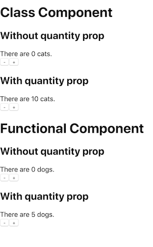

## Motivation

JavaScript is a **dynamically-typed** language meaning the interpreter assigns variables a type at runtime based on the variable's value at that specific time. That means when you write the following code,

```javascript
let myVar = "cat"
```

you don't have to define it as a variable of a certain type (String in this case) like you would have to do in a **strongly-typed** language (e.g. Java). You simply declare it as variable & at runtime, the interpreter realizes that 'cat' is a string & therefore treats `myVar` as a string.

This is nice because it frees you from having to really care about the whole idea of types but in doing so, opens the program upto a whole new world of runtime bugs.

```javascript
let a = "1"
let b = 5

// '1' + 5
console.log(a + b) // '15'
```

JavaScript uses **type coercion**, the ability for a variable to change type implicitly in certain contexts, to change the 5 into '5', & combine the two strings. Although this example doesn't cause an error, it is most likely not what the programmer intended to do.

Having static typing not only helps avoid any type related runtime errors but it also enables developers to catch type issues in realtime, quickly figure out what types are expected where, & even autocomplete suggestions. Clearly adding types is a win so let's get started!

## Setup

Typescript is an open source typed superset of JavaScript developed by Microsoft. It basically adds types & a few new features on top of the JavaScript you already know & love.

### Create React App

To get started with Typescript & React, the Create React App team has made it nice & simple,

```bash
yarn create react-app my-app --typescript
```

This creates the standard React starter app but now featuring TypeScript.

> Note instead of .js or .jsx, the file extension is now .tsx

In addition to the main app files now being .tsx, a tsconfig.json file was generated with pretty good defaults so we can leave it be for now.

### Extra Tooling (Optional)

- ESLint: linting tool that helps enforce coding & styling rules.
- Prettier: code formatting tool.
- Husky: write git hooks (things to do on git events)
- Lint-Staged: run linters, tests, etc against git staged files
- Cross-Env: set environment vars without worrying about platform

Used together, these tools keep your code well formatted locally & in your repository.

#### Install

```bash
yarn add eslint eslint-config-react-app @typescript-eslint/parser
@typescript-eslint/eslint-plugin prettier
eslint-config-prettier eslint-plugin-prettier husky lint-staged cross-env --dev
```

#### Setup

_/.eslintrc.js_

```javascript
module.exports = {
  parser: "@typescript-eslint/parser",
  extends: [
    "plugin:@typescript-eslint/recommended",
    "react-app",
    "prettier/@typescript-eslint",
    "plugin:prettier/recommended",
  ],
  plugins: ["@typescript-eslint", "react", "prettier"],
  rules: {
    "@typescript-eslint/explicit-function-return-type": 0,
    "@typescript-eslint/prefer-interface": 0,
    "@typescript-eslint/no-use-before-define": 0,
    "no-use-before-define": 0,
  },
}
```

The rule override for the explicit-function-return-type is so we don't get warnings for not writing the return type of our functional components & jest tests. The prefer-interface override is because I like to use types instead. no-use-before-define is overridden because I don't want to have to define my defaultProps above my Props type.

_/.prettierrc.js_

```javascript
module.exports = {
  semi: true,
  trailingComma: "all",
  singleQuote: true,
  printWidth: 120,
  tabWidth: 2,
}
```

_/package.json_

```json
...
"scripts": {
  ...
  "precommit": "lint-staged",
  "test:staged": "cross-env CI=true react-scripts test --findRelatedTests"
  ...
},
...
```

_/.huskyrc.js_

```javascript
module.exports = {
  hooks: {
    "pre-commit": "yarn precommit",
  },
}
```

_/.lintstagedrc_

```json
{
  "linters": {
    "**/*.+(js|jsx|ts|tsx)": [
      "eslint --fix",
      "prettier --write",
      "yarn test:staged",
      "git add"
    ]
  }
}
```

#### VSCode

If you use VSCode, you should install the ESLint & Prettier extensions.

```bash
code --install-extension dbaeumer.vscode-eslint
code --install-extension esbenp.prettier-vscode
```

I recommend you also set ESLint to auto-fix on save so your code is properly formatted after every save.

_settings.json (in VSCode)_

```json
...
"eslint.autoFixOnSave":  true,
"eslint.validate":  [
  "javascript",
  "javascriptreact",
  "typescript",
  "typescriptreact",
],
...
```

## React Specific Typescript Oddities

- Constant enums and namespaces are not supported
- Files containg JSX must have .tsx extension
- Can only use 'as' type assertions in JSX (no angle brackets)
- Must specify a JSX mode in tsconfig.json (default is fine)
  - preserve: emits the JSX, outputs .jsx
  - react: emits React.createElement, outputs .js
  - react-native: emits the JSX, outputs .js

> The mode can either be set in your tsconfig.json or specified using the --jsx command line flag.

## Prop Types

Getting your prop types right will make adding TypeScript to your components a breeze. Here is a cheatsheet for the common prop types you might need at some point,

```jsx
type Props = {
  message: string
  count: number
  disabled: boolean
  /** array of a type **/
  names: string[]
  /** string literals to specify exact string values w/ union type **/
  status: "waiting" | "success"
  /** any object as long as you dont use its properties (uncommon) **/
  obj: object
  /** same as above **/
  obj2: {}
  /** object w/ defined properties **/
  obj3: {
    id: string
    title: string
  }
  /** array of objects **/
  objArr: {
    id: string
    title: string
  }[]
  /** any function as long as you don't invoke it (uncommon) **/
  onSomething: Function
  /** function that doesn't take or return anything **/
  onClick: () => void
  /** function with named prop **/
  onChange: (id: number) => void
  /** optional prop **/
  optional?: OptionalType
  /** excepts all types of children **/
  children: React.ReactNode
  /** function as a child render prop **/
  functionChildren: (name: string) => React.ReactNode
  /** pass through style props **/
  style?: React.CSSProperties
  /** form event **/
  onChange?: React.FormEventHandler<HTMLInputElement>
  /* all the props of a button element without its ref **/
  props: Props & React.PropsWithoutRef<JSX.IntrinsicElements["button"]>
}
```

## Class Component

```jsx
import React, { Component } from "react"

// Define a type for props
type Props = {
  animal: string
} & typeof defaultProps

// Define default props
const defaultProps = Object.freeze({
  quantity: 0,
})

// Define a type for the state
type State = {
  currentQuantity: number
}

// Pass in Props & State types to the Component
export class PetStore extends Component<Props, State> {
  // Set initial state using props
  public readonly state = { currentQuantity: this.props.quantity }

  // Create handlers for button clicks
  public onDecrement = () => {
    // Stop currentQuantity from going negative
    if (this.state.currentQuantity > 0) {
      this.setState({ currentQuantity: this.state.currentQuantity - 1 })
    }
  }
  public onIncrement = () =>
    this.setState({ currentQuantity: this.state.currentQuantity + 1 })

  public render() {
    // Grab ‘animal’ prop
    const { animal } = this.props
    const { currentQuantity } = this.state

    return (
      <div>
        <div>
          There are {currentQuantity} {animal}.
        </div>
        <button onClick={this.onDecrement}>-</button>
        <button onClick={this.onIncrement}>+</button>
      </div>
    )
  }

  public static defaultProps: Readonly<{ quantity: number }>
}

// Set the component’s defaultProps to the ones we declared above
PetStore.defaultProps = defaultProps

// Export the component
export default PetStore
```

## Functional Component

The same component written as a Functional Component

```jsx
import React, { useState } from "react"

// Define a type for props
type Props = {
  animal: string,
} & typeof defaultProps

// Define default props
const defaultProps = Object.freeze({
  quantity: 0,
})

// Define initialState (not used in this example)
// const initialState = Object.freeze({});

export const PetStore = (props: Props) => {
  const { animal, quantity } = props
  const [currentQuantity, updateQuantity] = useState(quantity)

  // Ternary operator checks if currentQuantity is 0 & stops it from going negative
  const onDecrement = () =>
    updateQuantity(currentQuantity === 0 ? 0 : currentQuantity - 1)
  const onIncrement = () => updateQuantity(currentQuantity + 1)

  return (
    <div>
      <div>
        There are {currentQuantity} {animal}.
      </div>
      <button onClick={onDecrement}>-</button>
      <button onClick={onIncrement}>+</button>
    </div>
  )
}

// Assigns default props to our Component
PetStore.defaultProps = defaultProps

export default PetStore
```

## defaultProps

Typescript's support for React's defaultProps used to be lacking but now is really good. I find the way I used them in the examples to be the most clear way to use them. An important thing to note that I don't think is very obvious is that you never set a prop with a defaultProp as optional in the Props type because then it will be given it's type unioned with undefined (e.g. number | undefined). Instead you can include it without the optional property & Typescript will treat it as optional if it has a declared defaultProps or (my preferred way) merge the type of defaultProps into the Props type.

```jsx
// Best way
type Props = {
  animal: string,
} & typeof defaultProps

const defaultProps = Object.freeze({
  quantity: 0,
})

// Okay too
type Props = {
  animal: string,
  quantity: number,
}

const defaultProps = Object.freeze({
  quantity: 0,
})

// Not okay
type Props = {
  animal: string,
  quantity?: number, // number | undefined
}

const defaultProps = Object.freeze({
  quantity: 0,
})
```

## Types vs Interfaces

There are some differences between types & interfaces but in our case, when defining our props, it is fine to use either. I prefer to use types because they are more flexible & concise for my use cases.

```jsx
type FirstType = { foo: string, bar?: number }
type SecondType = { baz: boolean }
type MergedType = FirstType & SecondType
type EitherType = FirstType | SecondType

const mergedObject: MergedType = { foo: "I am foo", bar: 12, baz: true }
const eitherObject: EitherType = { foo: "I am still foo" }
const anotherEitherObject: EitherType = { baz: false }
```

## Grabbing Prop Types for Component

It is not necessary to export your component's Prop Types, instead if you need to access them from another file you can use `React.ComponentProps`.

```jsx
type ButtonProps = React.ComponentProps<typeof Button>
```

## Finding Types for Libraries

Some libraries don't include the types & you have to add them separately. Often times the package is simply @types/library-name but if not you can try this searching with,
[TypeSearch](https://microsoft.github.io/TypeSearch/)

## Result



[Code repository for post](https://github.com/thefinnomenon/react-and-typescript)
