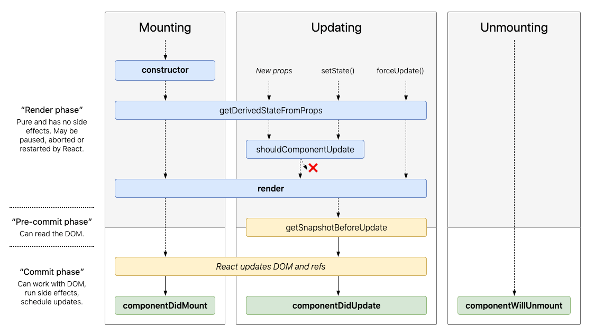

# What is React?

React is a JavaScript library for building user interfaces. It is an open source library that is made by Facebook and has a large community behind it. Three of the main pros for using React are

- Declarative
- Component-Based
- Learn once, write anywhere

## Declarative

Declarative programming is a paradigm that focuses on describing **what** you want instead of **how**. On the other end of the spectrum lies Imperative programming which is the **how** as opposed to the **what**. This difference is best observed in the code example below.

```javascript
// Imperative
$("#btn").click(function() {
  $(this).toggleClass("highlight")
  $(this).text() === 'Add Highlight'
    ? $(this).text('Remove Highlight')
    : $(this).text('Add Highlight')
})

// Declarative
<Btn
  onToggleHighlight={this.handleToggleHighlight}
  highlight={this.state.highlight}>
    {this.state.buttonText}
</Btn>
```

## Component-Based

With React, you can focus on building encapsulated components that manage their own state and then compose and re-use them to make complex UIs.

```javascript
// Name Component
function Name(props) {
  return <h1>Hello, {props.name}</h1>
}

// App Component w/ 3 Name Components
function App() {
  return (
    <div>
      <Name name="Alice" />
      <Name name="Bob" />
      <Name name="Chris" />
    </div>
  )
}

ReactDOM.render(<App />, document.getElementById("root"))
```

## Learn Once, Write Everywhere

React runs on multiple platforms including being able to be rendered on the server, browser, mobile, and desktop.

# What is React-Native?

React-Native is a library that brings React to mobile. It allows you to create native apps for Android and iOS using React. The React primitives render to native platform UI unlike the hybrid solutions that basically wrap your code in a webview.

This has become a popular choice for mobile development due to enabling high level of code reuse between the iOS and Android app. Also, the development experience is really enjoyable thanks to instantly see changes, meaning you no longer have to wait for your native builds to compile!

# JSX

JSX = JavaScript XML

This is the HTML-esque language you will be using to write your React UI.

```javascript
const element = <Text>My name is</Text>
```

The JSX above ends up being rendered as a native text label.

## Embed Expressions

A powerful feature of JSX is the ability to embed any JavaScript expressions into your JSX. To embed an expression you simply have to wrap it in curly braces.

```javascript
const name = "Chris"

function getAge() {
  return 28
}

const el1 = <Text>My name is {name}</Text>
const el2 = <Text>I'm {getAge()} years old</Text>
const el3 = <Text>2+2={2 + 2}</Text>
```

## Compilation

After compilation, JSX expressions become regular JavaScript function calls and evaluate to JavaScript objects. This allows you to use JSX in if and for loops, assign it to variables, pass it as arguments, and return it from functions.

```javascript
function greet(name) {
  if (user) {
    return <Text>Hello, {name}!</Text>
  }

  return <Text>Hello, anonymous!</Text>
}
```

## Empty Tag

If a JSX tag doesn't have any children (anything between the tag open and close) then it can be self closing using `/>`.

```javascript
const element = <Image source={myPicSrc} />
```

# Elements

Elements are the smallest building blocks of React apps. An element describes what you want to see on the screen.

```javascript
const element = <Text>Hello!</Text>
```

Elements are rendered into their corresponding code for the platform (e.g. <Text></Text> becomes a UILabel on iOS).

Elements are immutable, meaning they do not change. If one of an element's attributes or children changes then a new element is created and rendered in its place. This update only occurs on the elements that changed and not the whole tree.

# Components, Props, & Children

One of the main advantages of React is its focus on splitting the UI into independent, reusable pieces called components.

Components are JavaScript functions or classes that accept inputs (props) and return React elements describing the UI.

**Always start component names with a capital letter**. This is for React when rendering to the DOM to be able to distinguish between DOM tabs and components.

## Props

Props are the inputs passed to a component and are **read-only**.

```javascript
const element = <Welcome name="Chris" />
```

The value 'Chris' is passed to the component Welcome in the props object as **props.name**.

Props are the key to a component's reusability.

```javascript
const welcome1 = <Welcome name="Alice" />
const welcome2 = <Welcome name="Bob" />
const welcome3 = <Welcome name="Chris" />
```

There is a special prop named **children** which is the elements passed in-between the component tags.

```javascript
const Card = (props) => {
	return (
		<View>
			<Text>{props.title}</Text>
			{props.children}
		</View>;
}

const MyCard = (props) => {
	return (
		<Card title='Cats'>
			<Image source='logo.png') />	// <--
			<Text>Content</Text> 			// <-^- Children
		</Card>
	);
}
```

## Components

### Class-Based

Class-Based components used to be the only option for components that needed to hold state but are starting to fall out of popularity due to the introduction of React Hooks which give functional components all the powers of class-based components while still keeping them simpler.

```javascript
class Welcome extends React.Component {
  render() {
    return <Text>Hello, {this.props.name}</Text>
  }
}
```

> One of the main reasons people find functional components easier to use than class-based is the lack of having to use 'this'.

### Functional

A functional component is literally a component written as a JavaScript function. Since it is a JavaScript function it can be written in the classic way or as an arrow function.

```javascript
// Classic
function Welcome(props) {
	return <Text>Hello, {props.name}</Text>;
}

// Arrow
const Welcome = (props) => {
	return <Text>Hello, {props.name}</Text>;
};

// Arrow w/ Args Destructuring and Implicit return (Better)
const Welcome = ({ name }) => (
	<Text>Hello, {name}</Text>;
);
```

# State

State is the key to a component's encapsulation. It allows a component to hold and manage its own data.

> **Props** are set by the parent and do not change throughout the lifetime of a component whereas **state** is handled by the component and can change.

The way state is used in class-based components and functional components are one of the main differences between the two.

## Class-Based Component

```javascript
class Counter extends Component {
  state = { count: 0 }

  render() {
    return (
      <View>
        <Text>{this.state.count}</Text>
        <Button
          onPress={() => this.setState({ count: this.state.count + 1 })}
          title="+"
        />
        <Button
          onPress={() => this.setState({ count: this.state.count - 1 })}
          title="-"
        />
      </View>
    )
  }
}
```

## Functional Component

```javascript
const Counter = props => {
  const [count, setCount] = useState(0)

  return (
    <View>
      <Text>{count}</Text>
      <Button onPress={() => setCount(count + 1)} title="+" />
      <Button onPress={() => setCount(count - 1)} title="-" />
    </View>
  )
}
```

### useState Hook

The useState hook enables functional components to hold and manage state.

`const [value, setValue] = useState(initialValue)`

# Hooks & Lifecycle Methods

For advanced logic, class based components have lifecycle methods and functional components have hooks.

## Lifecycle Methods



We will cover the methods in bold because they are the most commonly used.

### constructor

`constructor(props)`

> If you don’t initialize state and you don’t bind methods, you don’t need to implement a constructor for your React component.

The function is invoked before the component is mounted.

Since your class-based component is a subclass of React.Component, in the constructor, it should call **super(props)** before any other statement. Otherwise, this.props will be undefined in the constructor.

Used for:

- Initializing local state by assigning an object to this.state.
- Binding event handler methods to an instance. (**Forgetting to bind a method to this is a common problem when using class components**)

> You should not call setState() in the constructor(). Instead, if your component needs to use local state, assign the initial state to this.state directly in the constructor.

```javascript
constructor(props) {
  super(props);
  // Don't call this.setState() here!
  this.state = { counter: 0 };
  this.handleClick = this.handleClick.bind(this);
}
```

### render

`render()`

**This is the only required method in a class component**

This function is invoked when there is a change that needs to be rendered.

The render function is used to return the content you want rendered; React elements, Arrays and fragments, portals, strings, numbers, booleans, or null. This function should be **pure**, meaning that it does not modify component state, it returns the same result each time it’s invoked, and it does not cause any side-effects.

```javascript
render() {
	return (
		<View>
			<Text>{this.state.name}</Text>
			<Text>{this.props.status}</Text>
		</View>
	);
}
```

### componentDidMount

`componentDidMount()`

This function is invoked immediately after a component is mounted.

Used for:

- loading data from a remote endpoint
- setting up subscriptions (should be unsubscribed in componentWillUnmount()).

```javascript
componentDidMount() {
	fetch('https://api.mydomain.com')
		.then(response => response.json())
		.then(data => this.setState({ data }));
}
```

### componentDidUpdate

`componentDidUpdate(prevProps, prevState, snapshot)`

This function is invoked immediately after an update occurs (excluding the initial render).

Used for:

- specific UI operations you want to happen after an update
- network requests that should be triggered from state or prop changes

```javascript
componentDidUpdate(prevProps) {
	if (this.props.searchTerm !== prevProps.searchTerm) {
		this.fetchData(this.props.searchTerm);
	}
}
```

> If you use setState(), it must be wrapped in a condition or it will cause an infinite loop.

### componentWillUnmount

`componentWillUnmount()`

This function is invoked immediately before a component is unmounted and destroyed.

Used for:

- do any necessary cleanup (e.g. cancel requests, unsubscribe, etc.)

```javascript
componentWillUnmount() {
	client.unsubscribe();
}
```

## Hooks

Hooks are a new way to add functionality to functional components. Its two main selling points are

- Extract stateful logic from a component so it can be independently tested and reused, all without changing your component hierarchy.
- Do everything with functional components

There are only two rules for using hooks

- Don't call Hooks from inside loops, conditions, or nested functions
- Only call Hooks from React functions

### useState

`const [value, setValue] = useState(initialValue);`

**This hook is used to add state to a functional component.**

If you want multiple state variables you simply call useState again with different variable names. Another option is to use another hook like _useReducer_ which is more apt for handling more complex state cases.

**value** holds the current state of _value_ and **setValue** is a function to update the state of _value_.

```javascript
const Counter = props => {
  const [count, setCount] = useState(0)

  return (
    <View>
      <Text>{count}</Text>
      <Button onPress={() => setCount(count + 1)} title="+" />
      <Button onPress={() => setCount(count - 1)} title="-" />
    </View>
  )
}
```

### useEffect

```javascript
useEffect(() => {
  // execute side effects

  return function cleanup() {
    // execute side effect cleanup if necessary
  }
}, [onlyRunEffectIfThisValueChanges])
```

**This hook is used to perform side effects in functional components.**

Side effects are actions like data fetching, setting up a subscription, and interacting with external resources. These are the things that would typically be in _componentDidMount_, _componentDidUpdate_, and _componentWillUnmount_. Also, just like with the _useState_ hook, if you have multiple side effects you handle each in their own _useEffect_.

**This hook is is triggered on the first render and after every subsequent render (if there is a clean up function, it is triggered in order to clesan up the previous effect before running the next one).**

Things to note

- Returning a cleanup function is optional. If you don't have anything to cleanup just drop the return.
- You can optionally pass in an array of variables as the second argument to specify that the effect should only run when one of them changes. Use this to make sure the effect (and clean up) is only triggered again when a relevant change occurs.
- Pass an empty array ([]) as the second argument if you want your effect (and clean up) to run only once.

```javascript
useEffect(() => {
  fetch("https://api.mydomain.com/search={searchTerm}")
    .then(response => response.json())
    .then(data => setResults({ data }))
}, [searchTerm])
```

### Custom Hooks

If you find yourself writing logic that you would like to use across multiple components, consider writing a custom hook. A custom hook is just a JavaScript function whose name starts with "use" and that may call other Hooks. Then to use it, you simply import it into your component file and use it accordingly.

# Conditional Render

Adding some simple JavaScript logic into your JSX can add some powerful conditional rendering to your component.

```javascript
const Greeting = ({ user }) => {
  if (user) {
    return <Text>Greetings {user}</Text>
  } else {
    return <Text>Greetings anonymous</Text>
  }
}
```

```javascript
// Using the ternary operator
// (condition ? true : false)
const Greeting = ({ user }) => {
  return <Text>Greetings {user ? user : "anonymous"}</Text>
}
```

```javascript
// If you want to return nothing (null) when a condition
// is false then you can just use bitwise and (&&)
const Greeting = ({ user }) => {
	return {user && <Text>Greetings {user}</Text>};
}
```

# Getting Started

Okay so now that we have covered the basics, we can move on to actually running some of this code on our phone! Thankfully for us there is a tool called Expo that makes the setup easy & lets us easily develop the app in a simulator or right on our device without having to setup XCode or Android Studio.

## Install Node

[Download Node](https://nodejs.org/en/download/)

## Install Expo CLI

`npm install -g expo-cli`

## Initialize Project

```bash
expo init MyProject
cd MyProject
```

## Start Development Server

`npm start` or `yarn start`

This starts the development server which you should see the status of in a browser page that opens. From this page you can launch the application in a simulator or download the Expo client on your device & scan the QR code to download & launch it there.
