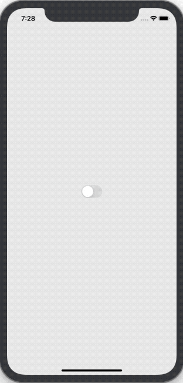

# Introduction
In this post we will be implementing light and dark mode in our React-Native app using styled-components, context, and react-native-appearance. By the end of the post our app will default to the OS theme on start, update on OS theme change, and toggle light and dark based off of the switch. If a picture says a thousand words than a GIF says like a million or something so just look at this GIF of what we will be making.



# Initialize Project
```shell
npx react-native init lightSwitch --template react-native-template-typescript
cd lightSwitch
```

```shell
git init
git add -A
git commit -m "react-native init"
```

# Add Styled-Components
```shell
yarn add styled-components
yarn add --dev @types/styled-components
```

# Theming
## Handle System Mode
Currently React-Native doesn't have an API for checking if the device is set to dark mode so we need this library.

```shell
yarn add react-native-appearance
```

### iOS
```shell
cd ios/
pod install
cd ..
```

### Android
Add the uiMode flag

```xml
// android/app/src/main/AndroidManifest.xml

<activity
...
android:configChanges="keyboard|keyboardHidden|orientation|screenSize|uiMode">
... >
```

Implement the onConfigurationChanged method

```java
// android/app/src/main/java/com/<PROJECT_NAME>/MainActivity.java

import android.content.Intent; // <--- import
import android.content.res.Configuration; // <--- import

public class MainActivity extends ReactActivity {
  ......

  // copy these lines
  @Override
  public void onConfigurationChanged(Configuration newConfig) {
    super.onConfigurationChanged(newConfig);
    Intent intent = new Intent("onConfigurationChanged");
    intent.putExtra("newConfig", newConfig);
    sendBroadcast(intent);
  }

  ......
}
```

## Define Types
```javascript
// index.d.ts

export type ThemeMode = 'light' | 'dark';

export interface ThemeContext {
  mode: ThemeMode;
  setMode(mode: ThemeMode): void;
}

export interface Theme {
  theme: {
    background: string;
    border: string;
    backgroundAlt: string;
    borderAlt: string;
    text: string;
  };
}
```

## Add Themes
### Light
```javascript
// themes/light.ts

import {Theme} from '../types';

const light: Theme = {
  theme: {
    background: '#ededed',
    border: '#bdbdbd',
    backgroundAlt: '#eaeaeb',
    borderAlt: '#bdbdbd',
    text: '#171717',
  },
};

export default light;
```

### Dark
```javascript
// themes/dark.ts

import {Theme} from '../types';

const dark: Theme = {
  theme: {
    background: '#2E3440',
    border: '#575c66',
    backgroundAlt: '#575c66',
    borderAlt: '#2E3440',
    text: '#ECEFF4',
  },
};

export default dark;
```

## Create Context
Check `contexts/ManageThemeContext.tsx`


## Example Usage
This is the example code behind the GIF at the top of this post. 

```javascript
import React from 'react';
import {Theme} from './types';
import styled from 'styled-components/native';
import ThemeManager, { useTheme } from './contexts/ManageThemeContext';
import { Switch } from 'react-native';

const Home = () => {
  // Helper function => useContext(ManageThemeContext)
  const theme = useTheme();
  return (
    <Container>
      <Switch
        value={theme.mode === 'dark'}
        onValueChange={value => theme.setMode(value ? 'dark' : 'light')}
      />
    </Container>
  );
};

// Get the background color from the theme object
const Container = styled.View<Theme>`
  flex: 1;
  justify-content: center;
  align-items: center;
  background: ${props => props.theme.background};
`;

// Wrap Home in the ThemeManager so it can access the current theme and
// the function to update it
const App = () => (
  <ThemeManager>
    <Home />
  </ThemeManager>
);

export default App;
```
