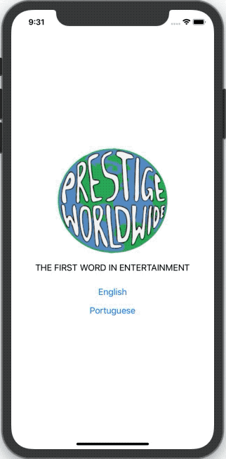

# Introduction
Not every project needs internationalization but if you plan to have global customers, say if you were making a worldwide entertainment company, then you would need internationalization (i18n for short). For this, we will use the popular internationalization library **i18next**, its React wrapper library **react-i18next**, and **react-native-localize** to detect the device language.



# Initialize Project
```shell
npx react-native init PrestigeWorldwide --template react-native-template-typescript
cd PrestigeWorldwide
```

```shell
git init
git add -A
git commit -m "react-native init"
```

# Internationalization
## Add Dependencies
```javascript
yarn add i18next react-i18next react-native-localize
```

### iOS
```javascript
cd ios
pod install
cd ..
```

## Add Locales
### English
```javascript
// locales/en.json

{
	"Hello": "Hello"
}
```

### Portuguese
```javascript
// locales/pt.json

{
	"Hello": "Olá"
}
```

## Add JSON Support to Typescript
```javascript
// tsconfig.json

{
  "compilerOptions": {
    ...
    "esModuleInterop": true,
    "resolveJsonModule": true,
    ...
  },
}
```

## i18n Functionality
```javascript
// utils/i18n.ts

import i18n from 'i18next';
import { initReactI18next } from 'react-i18next';
import * as RNLocalize from 'react-native-localize';

// Define the fallback language
const fallbackLanguage = { languageTag: 'en', isRTL: false };
// Check what the best supported langauge is based off of the device languages
const defaultLanguage =
  RNLocalize.findBestAvailableLanguage(['en', 'pt']) || fallbackLanguage;

// Load translation files
import en from '../locales/en.json';
import pt from '../locales/pt.json';

// Initialize the internationalization library
i18n.use(initReactI18next).init({
  lng: defaultLanguage.languageTag,
  resources: {
    en: { translation: en },
    pt: { translation: pt },
  },
  nsSeparator: false,
  keySeparator: false,
  fallbackLng: false,
  debug: true,
  interpolation: {
    escapeValue: false,
    formatSeparator: ',',
  },
  react: {
    wait: true,
  },
});

export default i18n;
```

## Example Usage
Download the logo and add it to `assets/images/`.

```javascript
// App.tsx

import React from 'react';
import {I18nextProvider, useTranslation} from 'react-i18next';
import i18 from './utils/i18n';
import {View, Image, Text, Button, StyleSheet} from 'react-native';

const Home = () => {
  const {t, i18n} = useTranslation();

  const changeLanguage = (lng: string) => {
    i18n.changeLanguage(lng);
  };

  return (
    <View style={styles.container}>
      <Image
        style={{width: 250, height: 250}}
        source={require('./assets/images/logo.png')}
      />
      <Text style={styles.message}>{t('THE FIRST WORD IN ENTERTAINMENT')}</Text>
      <Button title={t('English')} onPress={() => changeLanguage('en')} />
      <Button title={t('Portuguese')} onPress={() => changeLanguage('pt')} />
    </View>
  );
};

const App = () => {
  return (
    <I18nextProvider i18n={i18}>
      <Home />
    </I18nextProvider>
  );
};

const styles = StyleSheet.create({
  container: {
    flex: 1,
    justifyContent: 'center',
    alignItems: 'center',
  },
  message: {
    fontSize: 18,
    marginBottom: 20,
  },
});

export default App;
```

# Conclusion
Internationalization isn't always needed but as you can see it's not too difficult to setup. There are advanced options for loading languages from the backend and whatnot but that is for another day. Now go out there and start a global company so you have an excuse to use it!

[Checkout This Project’s Code On Github](https://github.com/thefinnomenon/react-native-internationalization)