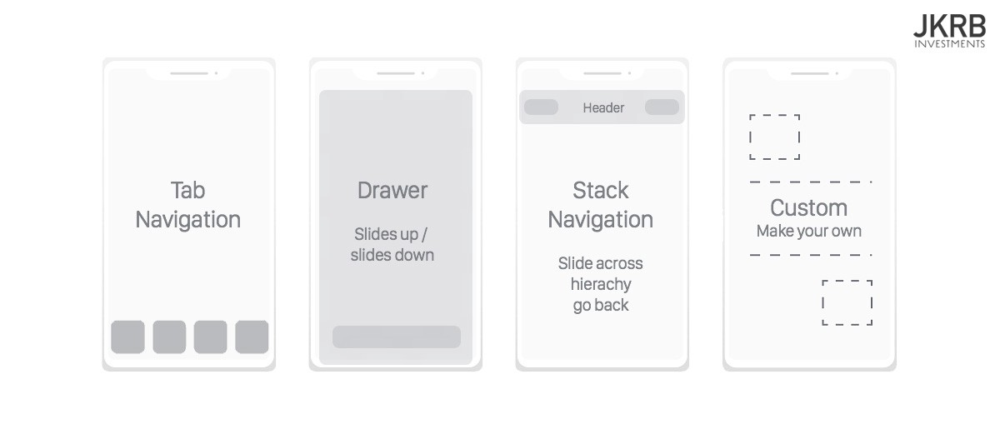
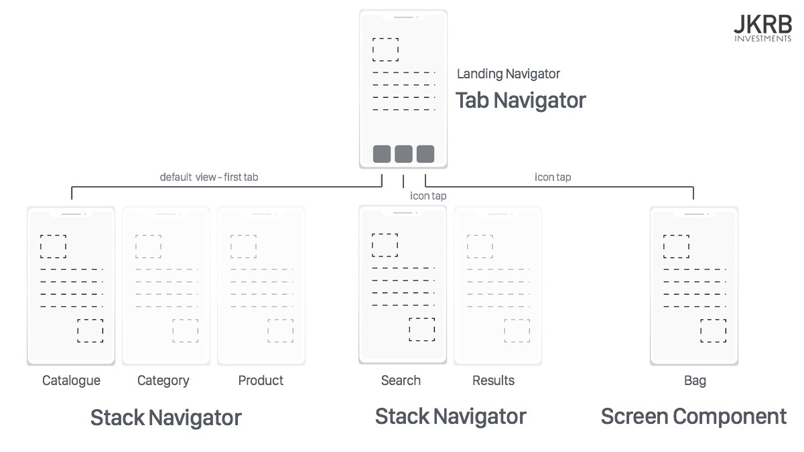
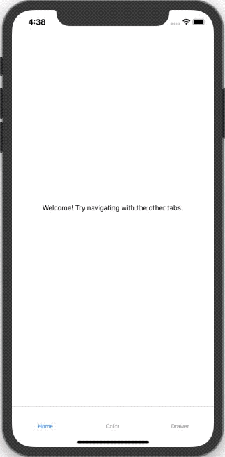

[Same post for react-navigation v4](https://thefinnternet.com/react-native-routing/)

# Introduction
One of the most important aspects of any application is navigation. Unless your application is truly one single screen, your user is going to have to click to navigate around and this requires a good navigation library. There are a few popular options in the React-Native world but the most popular, and the one recommended in Facebook’s React-Native documentation, is React Navigation. The library just underwent a huge rewrite with v5 which isn't a stable release yet but we will use this is the library throughout this post and cover how to use it for common navigation scenarios.

>**IMPORTANT NOTE**
>
>**I currently can't get the gestures to work for the drawer so if you need a drawer I would avoid upgrading to v5.**

# What are Navigators?
The main concept behind React Navigation is navigators. The app will essentially be a chain of navigators that define the app's screens and flow between them. There are multiple navigation types and each has its configuration options.



It is up to you to decide which navigator or navigators fit best in your app. You are not limited to just using one and they can even be embedded in one another (e.g. a stack navigator embedded in a tab navigator).



For our demo app we will be making an app with a tab navigator with three tabs. The first tab is simply a normal screen component, the second tab will have a stack navigator embedded with two buttons, "Red" and "Blue, that lead to a screen of the color clicked. The second tab has a drawer navigator with a screen containing a button to trigger the drawer.



# Initialize Project
```shell
npx react-native init magellan --template react-native-template-typescript
cd magellan
```

```shell
git init
git add -A
git commit -m "react-native init"
```

# Install Supporting Libraries
```shell
yarn add react-native-reanimated react-native-gesture-handler react-native-screens react-native-safe-area-context
```

## iOS
```shell
cd ios/
pod install
cd ..
```

## Android
```gradle
// android/app/build.gradle
...
dependencies {
    ...
    implementation 'androidx.appcompat:appcompat:1.1.0-rc01'
    implementation 'androidx.swiperefreshlayout:swiperefreshlayout:1.1.0-alpha02'
	...
}
...
```

```java
// android/app/src/main/java/com/<PROJECT_NAME>/MainActivity.java

...
import com.facebook.react.ReactActivityDelegate;
import com.facebook.react.ReactRootView;
import com.swmansion.gesturehandler.react.RNGestureHandlerEnabledRootView;
...

public class MainActivity extends ReactActivity {

  	...

	@Override
	protected ReactActivityDelegate createReactActivityDelegate() {
		return new ReactActivityDelegate(this, getMainComponentName()) {
			@Override
			protected ReactRootView createRootView() {
				return new RNGestureHandlerEnabledRootView(MainActivity.this);
			}
		};
	}
	
	...
}
```

# Install React-Navigation Core
```shell
yarn add @react-navigation/core@next @react-navigation/native@next
```

# Install Stack Navigator
```shell
yarn add @react-navigation/stack @react-native-community/masked-view
```

## iOS
```shell
cd ios/
pod install
cd ..
```

# Install Tab Navigator
```shell
yarn add @react-navigation/bottom-tabs
```

# Install Drawer Navigator
```shell
yarn add @react-navigation/drawer
```

# Example App
## App
```javascript
// App.js

import React from 'react';
import { NavigationNativeContainer } from '@react-navigation/native';
import 'react-native-gesture-handler';
import { enableScreens } from 'react-native-screens';
import TabNavigator from './src/navigators/TabNavigator';

// Enable react-native-screens for performance improvements
enableScreens();

// Import main Navigator & wrap it in NavigationNativeContainer
const App = () => (
  <NavigationNativeContainer>
    <TabNavigator />
  </NavigationNativeContainer>
);

export default App;
```

## Navigators
### TabNavigator
```javascript
// src/navigators/TabNavigator.tsx

import React from 'react';
import { createBottomTabNavigator } from '@react-navigation/bottom-tabs';

// Import Components
import HomeScreen from '../screens/HomeScreen';
import ColorStackNavigator from './ColorStackNavigator';
import DrawerNavigator from '../navigators/DrawerNavigator';

// Initialize Bottom Tab Navigator
const BottomTabs = createBottomTabNavigator();

// Create TabNavigator with three tabs
const TabNavigator = () => (
  <BottomTabs.Navigator>
    <BottomTabs.Screen name="Home" component={HomeScreen} />
    <BottomTabs.Screen name="Color" component={ColorStackNavigator} />
    <BottomTabs.Screen name="Drawer" component={DrawerNavigator} />
  </BottomTabs.Navigator>
);

export default TabNavigator;
```

### ColorStackNavigator
```javascript
import React from 'react';
import { createStackNavigator } from '@react-navigation/stack';

// Import Components
import ChooseColorScreen from '../screens/ChooseColorScreen';
import ColorScreen from '../screens/ColorScreen';

// Make type for the screens and params
export type ColorStackNavigatorParamList = {
  ChooseColor: undefined;
  Color: { color: 'blue' | 'red' };
};

// Initialize StackNavigator with the created type
const Stack = createStackNavigator<ColorStackNavigatorParamList>();

// Create ColorStackNavigator with two screens
const ColorStackNavigator = () => (
  <Stack.Navigator>
    <Stack.Screen
      name="ChooseColor"
      component={ChooseColorScreen}
      options={{ title: 'Choose Color' }}
    />
    <Stack.Screen
      name="Color"
      component={ColorScreen}
      options={({ route }) => ({ title: route.params.color })}
    />
  </Stack.Navigator>
);

export default ColorStackNavigator;
```

### DrawerNavigator
```javascript
import React from 'react';
import { createDrawerNavigator } from '@react-navigation/drawer';

// Import Components
import DrawerScreen from '../screens/DrawerScreen';
import OtherScreen from '../screens/OtherScreen';

// Make type for the screens and params
export type DrawerNavigatorParamList = {
  Drawer: undefined;
  Other: undefined;
};

// Initialize DrawerNavigator with the created type
const Drawer = createDrawerNavigator<DrawerNavigatorParamList>();

// Create DrawerNavigator with two screens
const DrawerNavigator = () => (
  <Drawer.Navigator>
    <Drawer.Screen name="Drawer" component={DrawerScreen} />
    <Drawer.Screen name="Other" component={OtherScreen} />
  </Drawer.Navigator>
);

export default DrawerNavigator;
```
> Currently the gesture-handler doesn't seem to be working so you can't slide the drawer out or tap it away. It is an ongoing issue so I will update when I find a solution.

## Screens
### HomeScreen
```javascript
const HomeScreen = () => {
  return (
    <View style={styles.container}>
      <Text>Welcome! Try navigating with the other tabs.</Text>
    </View>
  );
};
```

### ChooseColorScreen
```javascript
import React from 'react';
import { StackNavigationProp } from '@react-navigation/stack';
import { ColorStackNavigatorParamList } from '../navigators/ColorStackNavigator';
import { StyleSheet, View, Button } from 'react-native';

type ChooseColorScreenNavigationProp = StackNavigationProp<
  ColorStackNavigatorParamList,
  'ChooseColor'
>;

type Props = {
  navigation: ChooseColorScreenNavigationProp;
};

const ChooseColorScreen = ({ navigation }: Props) => (
  <View style={styles.container}>
    <Button
      title="Red"
      onPress={() => navigation.navigate('Color', { color: 'red' })}
    />
    <Button
      title="Blue"
      onPress={() => navigation.navigate('Color', { color: 'blue' })}
    />
  </View>
);

...

export default ChooseColorScreen;
```

### ColorScreen
```javascript
import React from 'react';
import { RouteProp } from '@react-navigation/core';
import { ColorStackNavigatorParamList } from '../navigators/ColorStackNavigator';
import { View } from 'react-native';

type ColorScreenRouteProp = RouteProp<ColorStackNavigatorParamList, 'Color'>;

type Props = {
  route: ColorScreenRouteProp;
};

const ColorScreen = ({ route }: Props) => {
  const { color } = route.params;

  return <View style={{ flex: 1, backgroundColor: color }} />;
};

export default ColorScreen;
```

### DrawerScreen
```javascript
import React from 'react';
import { DrawerNavigationProp } from '@react-navigation/drawer';
import { DrawerNavigatorParamList } from '../navigators/DrawerNavigator';
import { StyleSheet, View, Button } from 'react-native';

type DrawerScreenRouteProp = DrawerNavigationProp<
  DrawerNavigatorParamList,
  'Drawer'
>;

type Props = {
  navigation: DrawerScreenRouteProp;
};

const DrawerScreen = ({ navigation }: Props) => {
  return (
    <View style={styles.container}>
      <Button
        title="Click this text or swipe in from the left to toggle the drawer"
        onPress={() => navigation.toggleDrawer()}
      />
    </View>
  );
};

...
```
> Currently the gesture-handler doesn't seem to be working so you can't slide the drawer out or tap it away. It is an ongoing issue so I will update when I find a solution.

### OtherScreen
```javascript
...

const OtherScreen = () => {
  return (
    <View style={styles.container}>
      <Text>I am another screen!</Text>
    </View>
  );
};

...
```
> Currently the gesture-handler doesn't seem to be working so you can't slide the drawer out or tap it away. It is an ongoing issue so I will update when I find a solution.

# Conclusion
Navigation is really important for basically every app and thankfully React-Navigation makes quick, beautiful routing management and animated transitions a cinch. This post only covered the basics of how to use these main navigators but it should be enough to get you started. When you need to start styling your navigation bars, adding icons, or whatnot, head over to the beautiful React-Navigation documentation. As I mentioned in the post, gestures are currently not working on the DrawerNavigator. I will update the post when I find a solution.

[Checkout This Project’s Code On Github](https://github.com/thefinnomenon/react-native-navigation-v5)