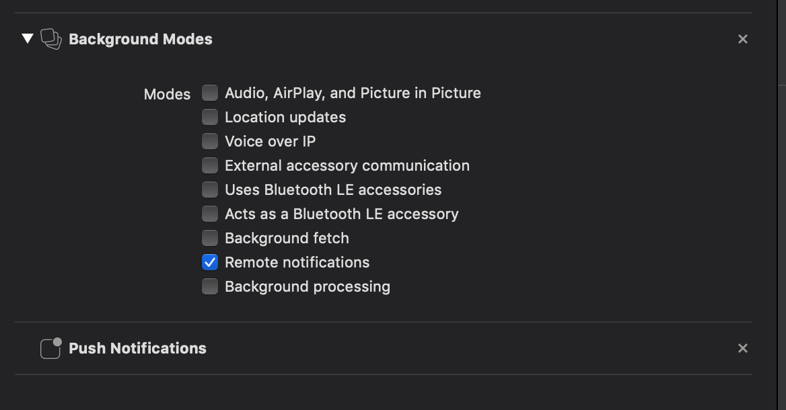

There are various libraries to handle notifications in a React-Native app but the support for both iOS and Android vary. The official React-Native solution, [react-native-push-notifications-ios](https://github.com/react-native-community/react-native-push-notification-ios) only supports iOS and the most popular community library, [react-native-push-notification](https://github.com/zo0r/react-native-push-notification) appears to currently be unmantained. After trying the most popular ones, I ended up using [react-native-firebase](https://github.com/invertase/react-native-firebase) which is well supported and has excellent documentation.


# Project Setup
For this application I won't be using Expo, but rather the `react-native-cli` and instead of plain JavaScript, I will use TypeScript.

Instead of reiterating the instructions provided by Facebook here, you can follow them at the following link, [Getting Started](https://facebook.github.io/react-native/docs/getting-started).

```javascript
npx react-native init notifications --template react-native-template-typescript
// Start an Android Simulator
cd notifications && react-native run-android
git init
git add -A
git commit -m "fresh react-native init"
```

# Create Firebase Project
## [Create a new Firebase Project](https://console.firebase.google.com/u/0/)


## Add Apps


### Register Android
> The Android Package Name can be found in /android/app/build.grade as applicationId. 
> Defaults to com.project_name


### Download google-services.json
Download `google-services.json` and add it to the app folder of your Android project.


### Register iOS
TODO

#### Download google-services.json
TODO

# Android
### Add Project Dependency
```
// android/build.gradle

buildscript {
    //...
    dependencies {
       //...
        classpath 'com.google.gms:google-services:4.2.0'
    //...
    }
}
//...
```

### Add App Dependencies
```
// android/app/build.gradle

//...
dependencies {
	//...
	implementation "com.google.android.gms:play-services-base:17.0.0"
	implementation "com.google.firebase:firebase-core:17.0.1"
	implementation "com.google.firebase:firebase-messaging:19.0.0"
	implementation 'me.leolin:ShortcutBadger:1.1.21@aar'
	//...
}
//...

apply plugin: 'com.google.gms.google-services'
```

### Add packages in MainApplication
```java
// android/app/src/main/java/com/notifications/MainApplication.java

//...

import io.invertase.firebase.messaging.RNFirebaseMessagingPackage;
import io.invertase.firebase.notifications.RNFirebaseNotificationsPackage;

//...

protected List<ReactPackage> getPackages() {
	@SuppressWarnings("UnnecessaryLocalVariable")
	List<ReactPackage> packages = new PackageList(this).getPackages();
	//...
	packages.add(new RNFirebaseMessagingPackage());
	packages.add(new RNFirebaseNotificationsPackage());
	  
	return packages;
}
```

### Modify AndroidManifest
```
// android/app/src/main/AndroidManifest.xml

<uses-permission android:name="android.permission.INTERNET" />
<uses-permission android:name="android.permission.RECEIVE_BOOT_COMPLETED" />
<uses-permission android:name="android.permission.VIBRATE" />

...
<application>
	...
	<activity
	    android:name=".MainActivity"
	    ...
	    android:launchMode="singleTop">
	    ...
	</activity>
	<service android:name="io.invertase.firebase.messaging.RNFirebaseMessagingService">
	    <intent-filter>
	      <action android:name="com.google.firebase.MESSAGING_EVENT" />
	    </intent-filter>
	</service>
	
	<service android:name="io.invertase.firebase.messaging.RNFirebaseBackgroundMessagingService" />
	
	<!-- Scheduled Notification Receivers -->
   <receiver android:name="io.invertase.firebase.notifications.RNFirebaseNotificationReceiver"/>
   <receiver android:enabled="true" android:exported="true"  android:name="io.invertase.firebase.notifications.RNFirebaseNotificationsRebootReceiver">
   		<intent-filter>
       	<action android:name="android.intent.action.BOOT_COMPLETED"/>
          <action android:name="android.intent.action.QUICKBOOT_POWERON"/>
          <action android:name="com.htc.intent.action.QUICKBOOT_POWERON"/>
          <category android:name="android.intent.category.DEFAULT" />
      	</intent-filter>
   	</receiver>
	
	<!-- Set custom default icon. This is used when no icon is set for incoming notification messages.
       See README(https://goo.gl/l4GJaQ) for more. -->
  	<meta-data
    	android:name="com.google.firebase.messaging.default_notification_icon"
    	android:resource="@drawable/ic_stat_ic_notification" />
  	<!-- Set color used with incoming notification messages. This is used when no color is set for the incoming notification message. See README(https://goo.gl/6BKBk7) for more. -->
  	<meta-data
   		android:name="com.google.firebase.messaging.default_notification_color"
   		android:resource="@color/colorAccent" />
   	<!-- Set default notification channel. This is used when incoming messages do not explicitly set a notification channel. -->
   	<meta-data
    android:name="com.google.firebase.messaging.default_notification_channel_id"
    android:value="@string/default_notification_channel_id"/>
</application>
```

# iOS
### Add Capabilities
In Xcode, enable the following capabilities:

- Push Notifications
- Background modes > Remote notifications




### Add Pods
```
// ios/Podfile

... 

pod 'Firebase/Core', '~> 6.3.0'
pod 'Firebase/Messaging', '~> 6.3.0'

```

### Modify AppDelegate
```
// ios/Notifications/AppDelegate.m

#import <Firebase.h>
#import "RNFirebaseNotifications.h"
#import "RNFirebaseMessaging.h"

//...

@implementation AppDelegate

- (BOOL)application:(UIApplication *)application didFinishLaunchingWithOptions:(NSDictionary *)launchOptions
{
  //...
  [FIRApp configure];
  [RNFirebaseNotifications configure];
  //...
}

//...

- (void)application:(UIApplication *)application didReceiveLocalNotification:(UILocalNotification *)notification {
  [[RNFirebaseNotifications instance] didReceiveLocalNotification:notification];
}

- (void)application:(UIApplication *)application didReceiveRemoteNotification:(nonnull NSDictionary *)userInfo
fetchCompletionHandler:(nonnull void (^)(UIBackgroundFetchResult))completionHandler{
  [[RNFirebaseNotifications instance] didReceiveRemoteNotification:userInfo fetchCompletionHandler:completionHandler];
}

- (void)application:(UIApplication *)application didRegisterUserNotificationSettings:(UIUserNotificationSettings *)notificationSettings {
  [[RNFirebaseMessaging instance] didRegisterUserNotificationSettings:notificationSettings];
}

//...

@end
```

# Javascript
### Add react-native-firebase
react-native-firebase had a major rewrite for v6 but unfortunately the Notifications module we are interested in is the only one that isn't updated yet so we are stuck on v5. When it finally finishes I will update this post!

`yarn add react-native-firebase@5.5.6`

> If you are using react-native v0.60 or higher you don't need to run link, it will be auto-linked.

### Notification Class
```javascript
import firebase from 'react-native-firebase';
import { Alert } from 'react-native';

export class NotificationService {
  onTokenRefreshListener = null;
  messageListener = null;
  notificationDisplayedListener = null;
  onNotificationListener = null;
  onNotificationOpenedListener = null;

  async getToken() {
    const fcmToken = await firebase.messaging().getToken();
    console.log(`Retrieved new token: ${fcmToken}`);
  }

  async checkPermission() {
    const enabled = await firebase.messaging().hasPermission();
    if (enabled) {
      console.log('Messaging permissions enabled');
      this.getToken();
    } else {
      this.requestPermission();
    }
  }

  async requestPermission() {
    console.log('Requesting messaging permissions');
    try {
      await firebase.messaging().requestPermission();
      this.getToken();
    } catch (error) {
      console.log('Messaging permission rejected');
    }
  }

  async createListeners() {
    this.onTokenRefreshListener = firebase
      .messaging()
      .onTokenRefresh(async fcmToken => {
        console.log(`Retrieved new token: ${fcmToken}`);
      });

    this.messageListener = firebase.messaging().onMessage(message => {
      console.log('on Message');
      console.log(message);
    });

    this.notificationDisplayedListener = firebase
      .notifications()
      .onNotificationDisplayed(notification => {
        // ANDROID: Remote notifications do not contain the channel ID. You will have to specify this manually if you'd like to re-display the notification.
        console.log('onNotificationDisplayed');
        console.log(notification);
      });

    this.onNotificationListener = firebase
      .notifications()
      .onNotification(notification => {
        console.log('onNotification');
        console.log(notification);

        // UNCOMMENT IF YOU WANT ANDROID TO DISPLAY THE NOTIFICATION
        notification.android.setChannelId('default').setSound('default');
        firebase.notifications().displayNotification(notification);

        Alert.alert(
          'Push Notification',
          notification.body,
          [{text: 'OK', onPress: () => console.log('OK Pressed')}],
          {cancelable: false},
        );
      });

    this.onNotificationOpenedListener = firebase
      .notifications()
      .onNotificationOpened(notification => {
        console.log('onNotificationOpened');
        console.log(notification);

        Alert.alert(
          'Push Notification',
          `${notification.action},${notification.notification},${notification.results}`,
          [{text: 'OK', onPress: () => console.log('OK Pressed')}],
          {cancelable: false},
        );
      });
  }

  async scheduleNotification(date) {
    const notification = new firebase.notifications.Notification()
      .setNotificationId('1')
      .setTitle('Test notification')
      .setBody('This is a test notification')
      .android.setPriority(firebase.notifications.Android.Priority.High)
      .android.setChannelId('default')
      .android.setAutoCancel(true);

    firebase
      .notifications()
      .scheduleNotification(notification, {
        fireDate: date.getTime(),
      })
      .catch(err => console.error(err));
  }

  configure() {
    const channel = new firebase.notifications.Android.Channel(
      'default',
      'default channel',
      firebase.notifications.Android.Importance.Max,
    );
    firebase.notifications().android.createChannel(channel);
    this.checkPermission();
    this.createListeners();
  }

  wasOpenedByNotification() {
    firebase
      .notifications()
      .getInitialNotification()
      .then(notificationOpen => {
        if (notificationOpen) {
          // App was opened by a notification
          // Get the action triggered by the notification being opened
          const action = notificationOpen.action;
          // Get information about the notification that was opened
          const notification = notificationOpen.notification;

          console.log('App was opened by a notification');
          console.log(action);
          console.log(notification);

          Alert.alert(
            'Push Notification',
            `${action},${notification}`,
            [{text: 'OK', onPress: () => console.log('OK Pressed')}],
            {cancelable: false},
          );
        } else {
          console.log('App was NOT opened by a notification');
        }
      });
  }
}

const Notification = new NotificationService();
export default Notification;
```

### App
```javascript
import React, {useEffect} from 'react';
import Notifications from './notifications';
import {SafeAreaView, StyleSheet, View, Button} from 'react-native';

export const App = () => {
  useEffect(() => {
    Notifications.configure();
  }, []);

  Notifications.wasOpenedByNotification();

  const sendLocalNotification = delay_seconds => {
    const date = new Date();
    date.setSeconds(date.getSeconds() + delay_seconds);
    Notifications.scheduleNotification(date);
  };

  return (
    <SafeAreaView style={{flex: 1}}>
      <View style={styles.container}>
        <Button
          onPress={() => sendLocalNotification(1)}
          title="Scheduled notification for now"
        />
        <Button
          onPress={() => sendLocalNotification(10)}
          title="Scheduled notification for 10 seconds from now"
        />
      </View>
    </SafeAreaView>
  );
};

const styles = StyleSheet.create({
  container: {
    flex: 1,
    alignItems: 'center',
    justifyContent: 'space-around',
    padding: 8,
  },
});

export default App;
```

# Testing Push Notifications
Grab your device's token from the console, head over to the Firebase console, click on Cloud Messaging and send a notification to your device using the device token.

# Conclusion
I am excited for the soon to be released v6 of react-native-firebase which should eliminate a lot of the manual native setup steps. You should also keep an eye on [react-native-push-notifications-ios](https://github.com/react-native-community/react-native-push-notification-ios) because if they wrap in Android support I think it would be a better library choice. 

[Checkout This Project's Code On Github](https://github.com/thefinnomenon/react-native-notifications)
