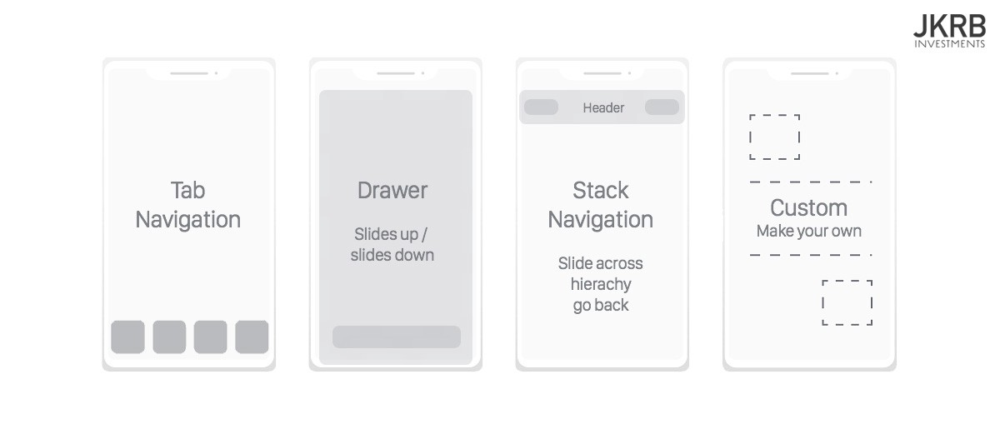
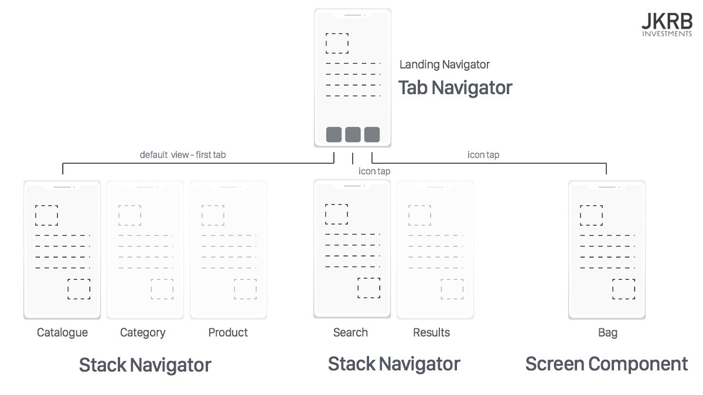
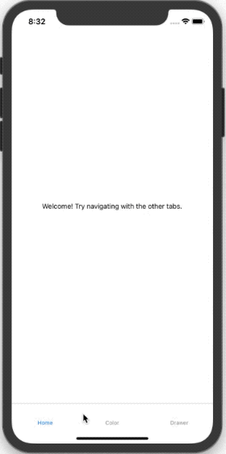

One of the most important aspects of any application is navigation. Unless your application is truly one single screen, your user is going to have to click to navigate around and this requires a good navigation library. There are a few popular options in the React-Native world but the most popular, and the one recommended in Facebook's React-Native documentation, is [React Navigation](https://reactnavigation.org/). This is the library I use and throughout this post, we will cover how to use it for common navigation scenarios.

# What is React Navigation?
React-Navigation is a pure JavaScript (no native code) library for navigation for React-Native apps. Being written completely in JavaScript gives you a lot of power and control over your navigation without ever having to write native code. The library implements the native navigation elements and transitions you are used to on iOS and Android in JavaScript as well as a simple API for handling navigation state and changes.

# What are Navigators?
The main concept behind React Navigation is navigators. The app will essentially be a chain of navigators that define the app's screens and flow between them. There are multiple navigation types and each has its configuration options.



It is up to you to decide which navigator or navigators fit best in your app. You are not limited to just using one and they can even be embedded in one another (e.g. a stack navigator embedded in a tab navigator).



For our demo app we will be making an app with a tab navigator with three tabs. The first tab is simply a normal screen component, the second tab will have a stack navigator embedded with two buttons, "Red" and "Blue, that lead to a screen of the color clicked. The second tab has a drawer navigator with a screen containing a button to trigger the drawer.



# Demo App
### Initialize App
```javascript
expo init magellan
// Choose blank
// Choose name (magellan)
cd magellan
yarn start
// Open on your device using the Expo app or open in a simulator
```

### Add the Navigation Library

`yarn add react-navigation`

### Add the Tab Navigation Library

`yarn add react-navigation-tabs`

### Add the Stack Navigation Library

`yarn add react-navigation-stack`

### Add the Drawer Navigation Library

`yarn add react-navigation-drawer`

### Add the Native Gesture Handling Library

`yarn add react-native-gesture-handler@^1.3.0`

### Add Animation Library

`yarn add react-native-reanimated@~1.1.0`

### Enable Navigation Optimization
Add the following code to App.js to optimize for view memory usage ([read more here](https://reactnavigation.org/docs/en/react-native-screens.html))

```javascript
// Before rendering any navigation stack
import { useScreens } from 'react-native-screens';
useScreens();
```

### Relaunch
You may have kill expo and relaunch it for the new packages.

# Implementing Navigation
## Screens
Screens are the pages you are going to actually display.

### HomeScreen
Nothing crazy in this screen, just a simple component with a View and Text.

```javascript
export default HomeScreen = () => {
  return (
    <View style={styles.container}>
      <Text>Welcome! Try navigating with the other tabs.</Text>
    </View>
  );
};
```

### ChooseColorScreen
This screen is a good example of triggering navigation based on a button press using the navigation prop which is automatically passed into a component that is in a navigator. As you can see the `navigate` function can take a second argument that is the values to pass to the screen you are navigating to. In the next screen you will see how to access it. This screen also shows you how to use `navigationOptions` on a functional component in order to set the title for the screen.

```javascript
export default ChooseColorScreen = ({ navigation }) => {
  return (
    <View style={styles.container}>
      <Button
        title="Red"
        onPress={() => navigation.navigate("Color", { color: "red" })}
      />
      <Button
        title="Blue"
        onPress={() => navigation.navigate("Color", { color: "blue" })}
      />
    </View>
  );
};

ChooseColorScreen.navigationOptions = screenProps => ({
  title: "Choose Color"
});
```

### ColorScreen
This screen is navigated to from the ChooseColorScreen using

`navigation.navigate("Color", { color: "red" })`

As you can see, the color value that was passed can be accessed using 

`navigation.getParam("color", "white")`

The first argument to `getParam` is the param key and the second is an optional default value.


```javascript
export default ColorScreen = ({ navigation }) => {
  const color = navigation.getParam("color", "white");

  return <View style={{ flex: 1, backgroundColor: color }} />;
};

ColorScreen.navigationOptions = screenProps => ({
  title: screenProps.navigation.getParam("color", "White")
});
```

### DrawerScreen
This screen is shown in the drawer navigator. It uses the components `navigationOptions` to set its `drawerLabel`. Also it toggles the drawer on button press using `navigation.toggleDrawer()`.

```javascript
export default DrawerScreen = ({ navigation }) => {
  return (
    <View style={styles.container}>
      <Button
        title="Click this text or swipe in from the left to toggle the drawer"
        onPress={() => navigation.toggleDrawer()}
      />
    </View>
  );
};

DrawerScreen.navigationOptions = {
  drawerLabel: "Home"
};
```

### OtherScreen
Nothing too exciting here, basically just a presentational component that also sets its `drawerLabel`.

```javascript
export default OtherScreen = () => {
  return (
    <View style={styles.container}>
      <Text>I am another screen!</Text>
    </View>
  );
};

navigationOptions = {
  drawerLabel: "Other"
};
```

## Navigators
### DrawerNavigator
This component is a great demonstration of how short and simple the drawer navigator is to use. Simply import the screens and pass them as routes to the navigator create function.

```javascript
import { createDrawerNavigator } from "react-navigation-drawer";

import DrawerScreen from "../screens/DrawerScreen";
import OtherScreen from "../screens/OtherScreen";

export default DrawerNavigator = createDrawerNavigator({
  Default: DrawerScreen,
  Other: OtherScreen
});
```

### ColorStackNavigator
Another great demonstration of how this library lets you write a short and simple component that does a lot. Simply import the screens and pass them as routes to the navigator create function.

```javascript
import { createStackNavigator } from "react-navigation-stack";

import ChooseColorScreen from "../screens/ChooseColorScreen";
import ColorScreen from "../screens/ColorScreen";

export default ColorStackNavigator = createStackNavigator({
  ChooseColor: ChooseColorScreen,
  Color: ColorScreen
});
```

### TabNavigator
This navigator is the main navigator for the app. As you can see, one tab points to a screen component and the other two point at our `ColorStackNavigator` and our `DrawerNavigator`. Configuring this navigator is basically the same as the previous two but since this is our main navigator we need to wrap it in `createAppContainer`.

```javascript
import { createAppContainer } from "react-navigation";
import { createBottomTabNavigator } from "react-navigation-tabs";

import HomeScreen from "../screens/HomeScreen";
import ColorStackNavigator from "./ColorStackNavigator";
import DrawerNavigator from "./DrawerNavigator";

const TabNavigator = createBottomTabNavigator({
	Home: HomeScreen,
	Color: ColorStackNavigator,
	Drawer: DrawerNavigator
});

export default createAppContainer(TabNavigator);
```

## App.js
The `App.js` has the call to `useScreens()` for the optimization that I mentioned before and then simply imports and returns the `TabNavigator`.

```javascript
import { useScreens } from "react-native-screens";
useScreens();
import TabNavigator from "./src/navigators/TabNavigator";

export default function App() {
  return <TabNavigator />;
}
```

# Conclusion
Routing is really important for basically every app and thankfully React-Navigation makes quick, beautiful routing management and animated transitions a cinch. This post only covered the basics of how to use these main navigators but it should be enough to get you started. When you need to start styling your navigation bars, adding icons, or whatnot, head over to the beautiful React-Navigation documentation.

[Checkout This Project's Code On Github](https://github.com/thefinnomenon/react-native-routing)