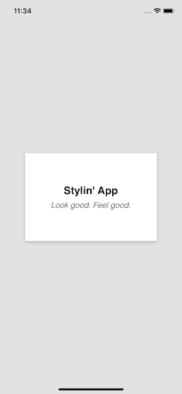
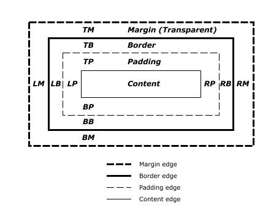

Nobody likes ugly apps, that's where styling comes in! There are two ways to style your React-Native app; StyleSheet and CSS-In-JS. There are pros and cons to each but in the end it is mostly a choice of preference. This post will cover them both, recreating the following design for each one.



# Styling Basics

Before going into the two different methods it is important to cover the basics of styling in general. React-Native basically uses Flexbox for handling layout and a subset of CSS for the rest of the styling needs.

## Flexbox

Flexbox is an algorithm used to provide a consistent layout on different screen sizes. The React-Native docs have a really good write-up of Flexbox, so instead of just copying it here, you should read through it [here](https://facebook.github.io/react-native/docs/flexbox).

## Views

Common CSS styling on a React-Native view,

- height: number
- width: number
- backgroundColor: color
- border: size color style
- padding: number
- margin: number



## Text

Common CSS styling on a React-Native view,

- color: color
- fontFamily: string
- fontSize: number
- fontStyle: ('normal', 'italic')
- fontWeight: ('normal', 'bold', '100', '200', ..., '900')
- textAlign: ('auto', 'left', 'right', 'center', 'justify')
- textAlignVertical: enum('auto', 'top', 'bottom', 'center')
- textDecorationLine: ('none', 'underline', 'line-through', 'underline line-through')
- textTransform: ('none', 'uppercase', 'lowercase', 'capitalize')

# Styling Methods

## StyleSheet

With StyleSheet, a javascript object is created to define the styles for your elements and are assigned to the elements via their `style` prop.

```javascript
const styles = StyleSheet.create({
  container: {
    flex: 1,
  },
})

;<View style={styles.container}>...</View>
```

### Demo Code

```javascript
import React from "react"
import { StyleSheet, Text, View } from "react-native"

export default function App() {
  return (
    <View style={styles.container}>
      <View style={styles.box}>
        <Text style={styles.title}>Stylin' App</Text>
        <Text style={styles.subtitle}>Look good. Feel good.</Text>
      </View>
    </View>
  )
}

const styles = StyleSheet.create({
  container: {
    flex: 1,
    backgroundColor: "#e2e2e2",
    alignItems: "center",
    justifyContent: "center",
  },
  box: {
    height: 200,
    width: 300,
    backgroundColor: "#fff",
    alignItems: "center",
    justifyContent: "center",
    shadowColor: "#000",
    shadowOffset: {
      width: 0,
      height: 2,
    },
    shadowOpacity: 0.25,
    shadowRadius: 3.84,
    elevation: 5,
  },
  title: {
    fontFamily: "Helvetica",
    fontWeight: "bold",
    fontSize: 24,
    paddingBottom: 8,
  },
  subtitle: {
    fontFamily: "Helvetica",
    fontStyle: "italic",
    fontWeight: "100",
    fontSize: 18,
  },
})
```

## CSS-In-JS

CSS-In-JS is a styling option that is fairly popular in React, allowing the developer to write normal CSS in javascript. In React-Native this isn't as groundbreaking since StyleSheet is already basically CSS as a JavaScript object but using a CSS-In-JS library still has it's advantages. There are numerous CSS-In-JS libraries but I prefer **styled-components**.

With styled-components, you write normal css in a template literal string to create a styled element.

```javascript
const Container = styled.View`
  flex: 1;
  background: #e2e2e2;
  align-items: center;
  justify-content: center;
`
```

### Advantages of styled-components over StyledSheet

#### Full CSS support

StyledSheet only supports a subset of CSS and also requires the property names to be camel cased, where as, styled-components supports as much CSS as possible on the React-Native platform.

A good example of this difference is with applying a box shadow,

```javascript
// StyledSheet

box: {
  shadowColor: "#000",
  shadowOffset: {
    width: 0,
    height: 2
  },
  shadowOpacity: 0.25,
  shadowRadius: 3.84,
  elevation: 5
},
```

```javascript
// styled-components

const Box = styled.View`
  box-shadow: 0px 2px 3.84px #000;
  shadow-opacity: 0.25;
  elevation: 5;
`
```

#### Dynamic Styling

styled-components makes dynamic styling and theming simple by enabling prop usage in the styling code.

```javascript
const Item = styled.View`
  background-color:${props=>props.primary ? "blue" : "green"};
`

// Green background
<Item />

// Blue background
<Item primary />
```

#### Increased Readability

I find styled-components to lead to better organized & readable code since your JSX tree contains descriptive names for the custom elements you created instead of a bunch of View, Text, etc tags.

```javascript
// StyleSheet

<View style={styles.container}>
  <View style={styles.box}>
    <Text style={styles.title}>Stylin' App</Text>
    <Text style={styles.subtitle}>Look good. Feel good.</Text>
  </View>
</View>
```

```javascript
// styled-components

<Container>
  <Box>
    <Title>Stylin' App</Title>
    <Subtitle>Look good. Feel good.</Subtitle>
  </Box>
</Container>
```

#### Cross Platform

Although the styles written with styled-components do not directly translate between React and React-Native, the concepts and general flow do which is a big win if you are developing on multiple platforms.

```javascript
// React
import styled from "styled-components"
const Container = styled.div`
  background: red;
  padding: 10px;
`

// React-Native
import styled from "styled-components"
const Container = styled.View`
  background: red;
  padding: 10px;
`
```

### Demo Code

> `yarn add styled-components`

```javascript
import React from "react"
import styled from "styled-components"

export default function App() {
  return (
    <Container>
      <Box>
        <Title>Stylin' App</Title>
        <Subtitle>Look good. Feel good.</Subtitle>
      </Box>
    </Container>
  )
}

const Container = styled.View`
  flex: 1;
  background: #e2e2e2;
  align-items: center;
  justify-content: center;
`

const Box = styled.View`
  height: 200;
  width: 300;
  background: #fff;
  align-items: center;
  justify-content: center;
  box-shadow: 0px 2px 3.84px rgba(0, 0, 0, 0.25);
  elevation: 5;
`

const Title = styled.Text`
  font-family: Helvetica;
  font-weight: bold;
  font-size: 24;
  padding-bottom: 8;
`

const Subtitle = styled.Text`
  font-family: Helvetica;
  font-style: italic;
  font-weight: 100;
  font-size: 18;
`
```
